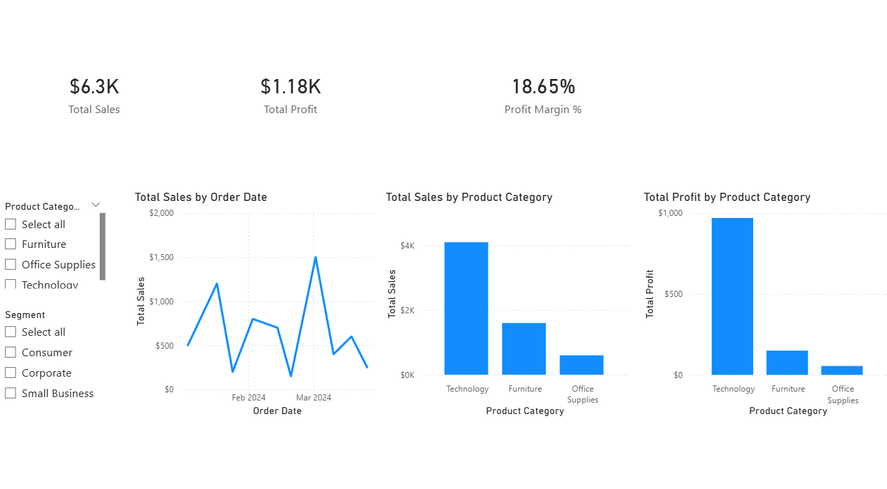

# Sales Performance Analysis

## Project Overview
This project analyzes retail sales data to evaluate revenue, profit, and overall business growth. 
The objective is to identify key revenue drivers, assess profit margins across products and customer segments, and evaluate whether the business is scaling efficiently.

The analysis is performed first in Excel for exploration and validation, then recreated in SQL for reproducibility and rigorous analysis.

## Tools Used
- Microsoft Excel (Pivot Tables, Charts)
- SQL (SQLite)
- DB Browser for SQLite
- Power BI (interactive dashboards, DAX measures) 
- GitHub (version control and documentation)

## Dataset
- `sales_data.csv` 

The dataset contains transactional sales data including:
- Order Date 
- Sales amount 
- Profit 
- Product category 
- Customer segment 

## Key Metrics Analyzed
- Total Sales 
- Total Profit 
- Profit Margin (weighted) 
- Average Profit per Order 

## Power BI Dashboard
An interactive dashboard was created in Power BI to visualize key metrics across dimensions. The dashboard includes:
- KPI cards for Total Sales, Total Profit, and Profit Margin %.
- Line chart showing sales trends over time
- Column chart comparing performance by Product Category
- Slicers for Product Category and Customer Segment to explore different business dimensions
**Dashboard Preview:**
 

## Key Insights
- **March** shows the highest sales ($2,750) with strong profitability, indicating month-over-month growth. 
- **Technology** products drive the majority of revenue and profit, making them the primary growth engine. 
- The **Corporate** customer segment leads in sales and maintains the highest profit margin, indicating high-quality, scalable revenue. 

> *Note:* Minor differences may exist between Excel pivot table results and SQL outputs due to calculation methodology. SQL uses a weighted profit margin (`SUM(profit) / SUM(sales)`), which more accurately reflects overall business performance than averaging row-level margins.

## Repository Structure
- `data/` 
  - `sales_data.csv`: Source dataset used for both Excel and SQL analysis 

- `excel/`
  - `Sales_Performance_Analysis.xlsx`

- `sql/` 
  - `sales_analysis.sql`: SQL queries for KPI calculation, monthly performance, product category analysis, customer segment analysis, and month x segment breakdowns 

- `power_bi/`
  - `sales_performance_dashboard/`
    - `sales_performance_dashboard.pbix`
    - `sales_performance_dashboard.png`
    - `sales_performance_dashboard_PDF.pdf`

